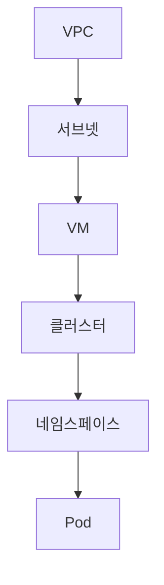
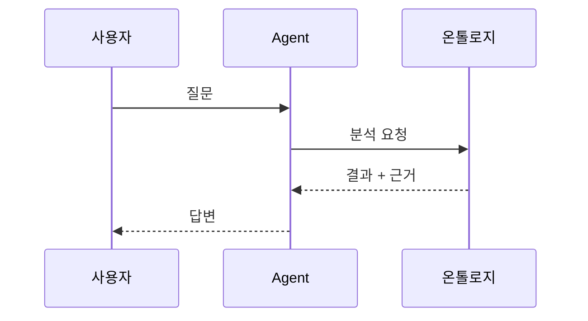

# 문서 꾸미기

마크다운은 문법이 단순해서 **꾸밀 수 있는 방법이 정해져 있습니다.**
아래는 실제로 효과가 큰 순서대로 정리했습니다.

---

## 1. 경고·정보 박스 (가장 효과 큼)

문서에서 **눈에 띄어야 할 내용**을 박스로 감쌉니다. `index.html`에 스타일이 이미 적용되어 있습니다.

### 쓰는 법

```markdown
> [!TIP]
> 이렇게 하면 편합니다

> [!NOTE]
> 참고로 알아두면 좋은 내용

> [!WARNING]
> 놓치면 문제가 생기는 지점

> [!ATTENTION]
> 반드시 확인해야 하는 사항
```

### 결과

> [!TIP]
> Pod IP가 아니라 **노드 서브넷 대역**을 등록해야 합니다

> [!WARNING]
> 배부 전/후에 따라 이익률이 30%와 5%로 갈립니다

---

## 2. 접기 / 펼치기

긴 내용을 **기본적으로 접어두고** 필요할 때만 펼칩니다. 명령어 모음이나 부록에 유용합니다.

```markdown
<details>
<summary>전체 명령어 보기</summary>

```bash
kubectl get nodes -o wide
kubectl get pods -n apex -o wide
```

</details>
```

<details>
<summary>펼쳐보기 예시</summary>

이렇게 숨겨둘 수 있습니다. 문서가 길어질 때 스크롤 부담을 줄여줍니다.

</details>

---

## 3. 탭

같은 주제를 **환경별·방식별로 나눠** 보여줄 때 씁니다. Windows/Mac, Python/Node 같은 경우입니다.

```markdown
<!-- tabs:start -->

#### **Python**

```bash
python -m http.server 3000
```

#### **Node.js**

```bash
npx docsify-cli serve .
```

<!-- tabs:end -->
```

---

## 4. 표 정렬

숫자는 오른쪽, 라벨은 가운데로 맞추면 훨씬 읽기 좋습니다.

```markdown
| 항목 | 값 | 비고 |
|:---|---:|:---:|
| 객실 매출 | 36억 | 확정 |
| GOP | 22억 | 확정 |
```

| 기호 | 정렬 |
|---|---|
| `:---` | 왼쪽 |
| `---:` | 오른쪽 |
| `:---:` | 가운데 |

---

## 5. 배지 · 아이콘

### 이모지

제목이나 표에 쓰면 시각적 구분이 생깁니다. 남용하면 지저분해지니 **한 문서에 3~4종류**로 제한하세요.

```markdown
## 🏨 호텔 지표
## ⚙️ 인프라
## ✅ 완료  ⚠️ 주의  ❌ 불가  ★ 중요
```

### 상태 표시

```markdown
| 항목 | 상태 |
|---|---|
| 인프라 구성 | ✅ 완료 |
| 온톨로지 | 🔄 진행 중 |
| 실데이터 연계 | ⏸ 대기 |
```

---

## 6. 다이어그램 (Mermaid)

**글로 설명하기 어려운 구조**를 그림으로 그립니다. 코드로 작성하므로 수정이 쉽습니다.

`index.html`에 플러그인이 포함되어 있습니다.

### 흐름도

````markdown

````

### 계층 구조

````markdown

````

### 순서도 (시퀀스)

````markdown

````

---

## 7. 코드 블록 꾸미기

### 언어 지정 — 문법 강조

````markdown
```bash
kubectl get pods
```

```yaml
rules:
  - host: example.com
```

```json
{ "metric": "GOPPAR", "value": 147000 }
```
````

### 파일명 표시

````markdown
```yaml
# _sidebar.md
* [홈](/)
```
````

---

## 8. 문서 내 이동

### 목차 링크

```markdown
[Flow-through 설명으로 이동](#7-성장의-질을-본다--flow-through)
```

**앵커 만드는 규칙** — 제목을 소문자로, 공백은 `-`로, 특수문자는 제거합니다.

### 다른 문서의 특정 위치

```markdown
[방화벽 함정](infra/kubernetes.md#4-방화벽--왜-pod에서-외부-vm으로-못-가는가)
```

---

## 9. 강조의 우선순위

**모두 강조하면 아무것도 강조되지 않습니다.** 아래 순서로 절제해서 쓰세요.

| 방법 | 용도 | 빈도 |
|---|---|---|
| `**굵게**` | 문장 내 핵심 단어 | 자주 |
| `> 인용` | 보충 설명·예시 | 보통 |
| `> [!WARNING]` | 놓치면 안 되는 것 | 드물게 |
| `★` | 문서 전체에서 가장 중요 | 문서당 2~3개 |

---

## 10. 문서 구조 템플릿

새 문서를 만들 때 이 틀로 시작하면 일관성이 생깁니다.

```markdown
# 문서 제목

> 한 줄 요약 — 이 문서가 무엇을 다루는지

---

## 0. 전체 그림

(표나 다이어그램으로 구조를 먼저 제시)

---

## 1. 첫 번째 주제

### 소주제

본문...

> [!TIP]
> 실무 팁

---

## 부록. 용어 빠른 찾기

| 용어 | 정의 |
|---|---|

## 부록. 체크리스트

- [ ] 확인 항목
```

---

## 11. 스타일 직접 바꾸기

`index.html` 안의 `<style>` 부분을 수정하면 전체 문서의 모양이 바뀝니다.

```css
:root {
  --theme-color: #1F3864;   /* 강조색 — 링크·제목 */
  --sidebar-width: 280px;   /* 메뉴 너비 */
}
```

### 자주 바꾸는 것

| 항목 | 위치 |
|---|---|
| 강조색 | `--theme-color` |
| 본문 폭 | `.markdown-section { max-width: 900px; }` |
| 글꼴 | `body { font-family: ... }` |
| 표 배경 | `.markdown-section th { background: ... }` |

### 다른 테마 쓰기

`index.html`의 테마 링크를 바꾸면 전체 분위기가 달라집니다.

```html
<!-- 기본(Vue) -->
<link rel="stylesheet" href="https://cdn.jsdelivr.net/npm/docsify@4/lib/themes/vue.css">

<!-- 다크 -->
<link rel="stylesheet" href="https://cdn.jsdelivr.net/npm/docsify@4/lib/themes/dark.css">

<!-- 심플 -->
<link rel="stylesheet" href="https://cdn.jsdelivr.net/npm/docsify@4/lib/themes/pure.css">
```

---

## 12. 작성 시 권장 습관

**① 표를 적극 활용하세요.** 마크다운에서 가장 가독성이 좋은 요소입니다. 3개 이상의 항목을 나열할 때는 목록보다 표가 낫습니다.

**② 문단은 3~4줄 이내로 끊으세요.** 화면에서는 종이보다 긴 문단이 훨씬 답답하게 읽힙니다.

**③ 제목만 읽어도 내용이 보이게 쓰세요.** "개요" 대신 "왜 Pod에서 외부 VM으로 못 가는가"처럼요.

**④ 예시를 먼저, 정의를 나중에.** 추상적 정의보다 구체적 숫자가 먼저 나오면 이해가 빠릅니다.

**⑤ 문서 끝에 체크리스트를 두세요.** 나중에 다시 볼 때 본문을 안 읽어도 됩니다.
