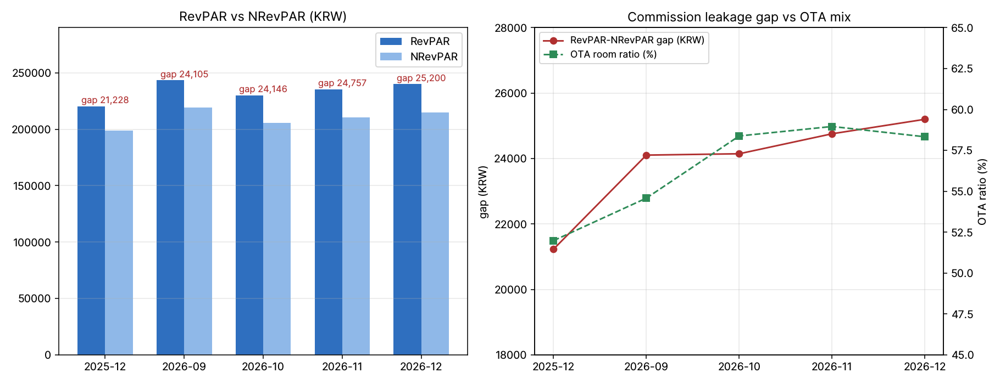

# 에이전트 예제

> [1.3 온톨로지 설계](hotel-ontology.md) + [1.4 그래프DB 적용(Neo4j)](hotel-ontology-graphdb.md) + [1.5 샘플데이터](sample-data.md)를 기반으로 만든 추정/추론 에이전트입니다. GitHub Pages는 정적 파일만 서빙하기 때문에 이 페이지에서 바로 실행은 안 되고, 실제로 돌려본 질문·답변과 로컬 실행 방법을 정리했습니다.

---

## 1. 무엇을 할 수 있나

| 능력 | 도구 |
|---|---|
| 호텔 지표 계산 (OCC·ADR·RevPAR·NRevPAR·부문이익·GOP·GOPPAR·Flow-through·원가율·시장지수) | `metrics.py` 기반 계산 도구 9종 |
| CLV·attach rate (고객 데이터 기반) | `get_attach_rate`, `get_customer_lifetime_value` |
| 미리 만들어두지 않은 질문도 그래프에서 직접 탐색 | `run_cypher_query` (읽기 전용) |
| "판단 근거를 알려줘" → 질문 계보를 트리로 제시 | `get_judgment_basis` |
| 외부 맥락(날씨·뉴스 등)이 필요하면 검색 | `web_search` |
| 비교 수치는 차트로 시각화 | `code_execution` (matplotlib) |

답변은 항상 **결론 → 원인 → 해결방법(제안, 향후 추정 포함)** 순서로 나오고, 1.3의 6가지 함정(매출만 보고 판단 금지, 배부 전/후 구분, GOPPAR 부문 오용 금지 등)을 가드레일로 지킵니다.

---

## 2. 실제 테스트 예시

**질문**: "2026년 12월 RevPAR랑 NRevPAR 차이가 왜 나는거야?"

> **결론**
> 2026년 12월 RevPAR 240,000원 vs NRevPAR 214,800원 — 차이 25,200원(RevPAR의 10.5%)이고, 이 차이는 전부 판매채널 수수료 유출입니다. OTA 객실 비중이 58.33%로 높아서, "매출(RevPAR)은 올랐지만 손에 남는 돈(NRevPAR)은 그만큼 못 올라온" 구조입니다.
>
> **원인**
>
> | 구분 | 2025-12 | 2026-11 | 2026-12 |
> |---|---|---|---|
> | OCC | 75.43% | – | 80.0% |
> | RevPAR | 220,229 | 235,302 | 240,000 |
> | NRevPAR | 199,000 | 210,545 | 214,800 |
> | 격차 | 21,228 | 24,757 | 25,200 |
> | OTA 비중 | 51.98% | 58.96% | 58.33% |
>
> 1. 물량·단가는 좋아졌습니다 — 전년 동월 대비 RevPAR +9.0%.
> 2. 그런데 개선분의 일부가 채널로 빠져나갑니다 — 격차가 21,228원 → 25,200원으로 커졌습니다.
> 3. 채널 믹스가 원인입니다 — OTA 비중이 하반기 내내 5~7%p 높은 수준에 고착됐습니다.
>
> ⚠️ **데이터 신뢰도 단서**: NRevPAR(KPI-GOP-03)는 "부분보유" 상태입니다. 근거 데이터셋인 D-09(채널별 수수료율)가 "미보유"라서, 지금 값은 샘플상 가정이며 실제 판정은 채널 계약 수수료율이 들어와야 신뢰 가능합니다.
>
> **해결방법(제안)**
> 1. [P0] G-F11 해소 — OTA 계약별 수수료율표 확보 (계약서로 대체 가능, 2~4주 내 가능)
> 2. [P1] G-09 해소 — 채널·TA 수수료율을 채널 마스터 속성으로 부착
> 3. 직판 전환 캠페인 — 성수기(12월)에 OTA→직판 5%p 전환 목표
>
> **향후 추정** (2025-12, 2026-09~12 추이 근거)
> - 현 추세 유지 시: 격차 25,000~26,000원대 지속 추정
> - OTA→직판 5%p 전환 성공 시: 격차 23,000원대로 축소 추정 (방향성 추정, D-09 미보유로 정밀 추정 아님)
>
> *(근거 노드: KPI-GOP-03, D-09, G-F11, G-09, BQ-3.1-2, BQ-3.2-2, HQ-3, HQ-4)*

이때 에이전트가 직접 생성한 차트:



---

## 3. "판단 근거" 조회 예시

위 답변 끝의 근거 노드 중 하나(`KPI-FT-05`, 임대 부문 Flow-through)로 `get_judgment_basis`를 호출하면 이런 트리가 나옵니다 — 어느 전략 질문에서 내려왔는지(위쪽)와 어떤 데이터·갭에 근거했는지(아래쪽)를 한 번에 보여줍니다.

```
HQ-3. 시장 성장과 내부 성장의 격차는 어디서 발생하는가 [부분보유]
   └─ SQ-1. 이익 희석 - 성장액 중 얼마가 이익으로 전환되는가 [부분보유]
      └─ DQ-1.1. 부문별 Flow-through는 얼마인가 [부분보유]
         └─ BQ-1.1-1. 매출은 늘었는데 부문 이익이 따라 오르지 않은 부문은 어디인가 [미보유]
            └─ KPI-FT-05. Flow-through(임대) [부분보유]
               ├─ 부문별 매출 (객실·F&B·BQT·기타) [보유]
               ├─ 부문별 직접원가 [부분보유]
               └─ 공통비 배부 규칙 [미보유]
                   └─ G-01. 부문 원가 배부 규칙 [미보유]
```

---

## 4. 로컬에서 직접 실행하기

저장소를 내려받은 뒤 (`agent/.env.example`을 `.env`로 복사해 Anthropic API 키·Neo4j 접속정보 채우기):

```bash
cd knowledge-base
pip install -r agent/requirements.txt

# CLI로 한 번 질문
python -m agent.agent "질문 내용"

# 또는 웹 채팅 UI
python -m streamlit run agent/app.py
```

**주의**
- Claude API는 실제 비용이 발생합니다 (질문 1건당 대략 10~50원 수준).
- Neo4j는 [1.4 그래프DB 적용](hotel-ontology-graphdb.md)에서 설명한 대로 AuraDB Free 인스턴스를 만들고 `agent/graph_loader.py` · `agent/hq_tree_loader.py`로 먼저 적재해야 합니다.
- 모든 데이터는 [1.5 샘플데이터](sample-data.md)의 가상 데이터입니다.
