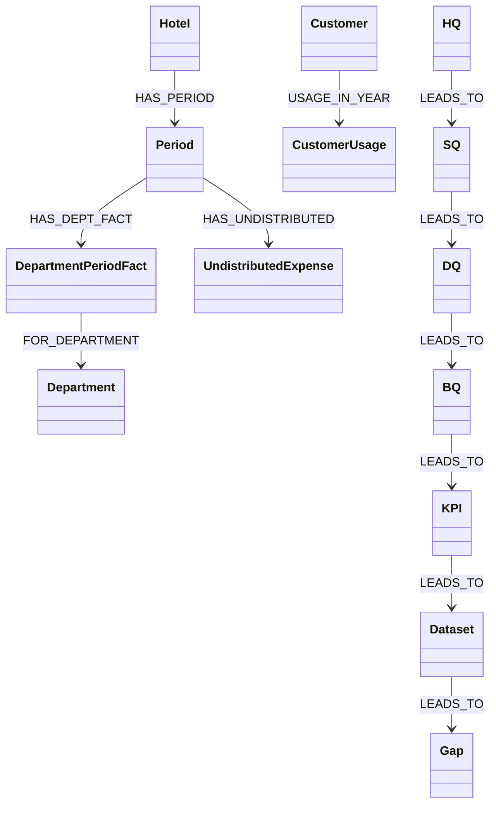

# 그래프DB 적용 (Neo4j)

> [1.3 온톨로지 설계 방안](hotel-ontology.md)이 정의한 클래스·관계(의미 모델)를, 실제 Neo4j(AuraDB)에 어떻게 옮겼는지 정리합니다.
> **온톨로지 설계 ≠ 그래프DB 적재**입니다 — 온톨로지는 "무엇이 존재하고 어떻게 연결되는가"를 정의하는 것이고, 그래프DB 적재는 그중 **무엇을 실제로 노드/엣지로 저장할지, 무엇은 계산식으로만 남길지, 무엇은 아예 생략할지**를 정하는 구현 단계입니다. 아래는 그 구현 선택을 그대로 노출한 매핑입니다.

---

## 1. 핵심 설계 선택 3가지

1. **사실(Fact)만 저장하고, 지표(Metric)는 저장하지 않는다** — GOP·GOPPAR·Flow-through·부문이익(배부 후) 같은 값은 그래프에 노드로 없습니다. 항상 Revenue/DirectCost/UndistributedExpense 같은 원천 사실에서 쿼리 시점에 계산합니다 (1.3 0장 원칙 그대로).
2. **분해 축(층2 USALI·층3 여정·부속축 자본, L0/L1/L2)은 그래프에 올리지 않는다** — 이 라벨들은 전역적으로 유일하지 않습니다(예: "L1"이 "고객 축"도 되고 "객실 부문 이익"도 됩니다). 그대로 노드화하면 서로 다른 개념이 하나로 뭉개지는 오류가 생기므로, **구조(엣지)만 뽑을 때 걸러내고 노드로는 만들지 않았습니다.**
3. **Fact 그래프와 질문 계보 그래프는 서로 다른 서브그래프다** — 샘플데이터(호텔 실적)와 전개표(HQ 질문 계보)는 한 그래프 안에 같이 있지만, 지금은 KPI 노드가 실제 Department/Period 노드를 가리키는 엣지는 없습니다. KPI와 숫자를 연결하는 건 `metrics.py`(Python 계산 도구)가 담당하고, 그래프는 "이 KPI가 어떤 질문에서 나왔고 어떤 데이터·갭에 의존하는가"만 담당합니다.

---

## 2. Fact 클래스 매핑

| 1.3 온톨로지 클래스 | Neo4j 레이블 | 저장 방식 | 비고 |
|---|---|---|---|
| Hotel | `:Hotel` | 노드 1개 | roomCount 속성 |
| Period, RoomInventoryDay, MarketBenchmark | `:Period` | 노드 48개 | 세 클래스를 하나로 합침 — 한 달에 1:1로 묶이는 값들이라 분리할 이유가 없었음 |
| RevenueFact + DirectCost | `:DepartmentPeriodFact` | 노드 192개 | 두 클래스가 항상 같이 쓰여서(부문 이익 계산에 둘 다 필요) 하나로 합침 |
| Department | `:Department` | 노드 4개 | |
| UndistributedExpense | `:UndistributedExpense` | 노드 192개 | |
| Customer | `:Customer` | 노드 300개 | |
| Booking (예약 건별) | `:CustomerUsage` | 노드 708개 | 예약 건이 아니라 "고객×연도 요약"으로 단순화 — 샘플데이터 생성 단계에서부터 건별이 아닌 연간 집계로 만들었기 때문 |
| DepartmentalProfit (배부 전/후) | *(없음 — 쿼리 시점 계산)* | — | `revenue - directCost`, 배부 후는 공통비 배부까지 쿼리로 |
| GOP · GOPPAR · Flow-through · MPI 등 Metric | *(없음 — 쿼리/도구 계산)* | — | `run_cypher_query`의 집계 쿼리 또는 `metrics.py` 도구가 계산 |
| AllocationRule | *(그래프에 없음, 코드 상수)* | — | `sample_data_gen.py`의 `UNDISTRIBUTED_RATIO`·`DEPT_COST_RATIO`에 고정값으로 존재 |

## 3. 질문 계보 클래스 매핑

| 1.3 개념 | Neo4j 레이블 | 적재된 개수 | 검증 |
|---|---|---|---|
| HQ 전략 질문 | `:HQ` | 7 | HQ Summary 시트와 일치 |
| SQ | `:SQ` | 5 | |
| DQ | `:DQ` | 23 | |
| BQ | `:BQ` | 47 | |
| KPI (Metric 레지스트리) | `:KPI` | 53 | "KPI 보유 목록" 시트 제목의 "53건"과 정확히 일치 |
| Dataset | `:Dataset` | 27 | "필요 데이터 D-01~D-27"과 정확히 일치 |
| Gap | `:Gap` | 60 | 보유(29)+미보유(31) 목록 합계와 정확히 일치 |
| 분해 축 (층2 USALI·층3 여정·부속축 자본, L0/L1/L2) | *(그래프에 없음)* | — | 위 "핵심 설계 선택 2" 참고 |

## 4. 관계 매핑

| 1.3 관계 | Neo4j 관계 |
|---|---|
| Hotel이 Period를 가짐 | `(:Hotel)-[:HAS_PERIOD]->(:Period)` |
| Department가 Revenue/DirectCost를 가짐 | `(:Period)-[:HAS_DEPT_FACT]->(:DepartmentPeriodFact)-[:FOR_DEPARTMENT]->(:Department)` |
| Period가 UndistributedExpense를 가짐 | `(:Period)-[:HAS_UNDISTRIBUTED]->(:UndistributedExpense)` |
| Customer가 이용 기록을 가짐 | `(:Customer)-[:USAGE_IN_YEAR]->(:CustomerUsage)` |
| HQ→SQ→DQ→BQ→KPI→Dataset→Gap 분해 | `(부모)-[:LEADS_TO]->(자식)` — 전부 같은 관계 타입 하나로 통일 (전개표의 "경로" 컬럼에서 그대로 추출) |

---

## 5. 그래프 구조 (실제 적재 결과)



위 두 서브그래프(Fact / 질문 계보)는 지금 **엣지로 직접 연결돼 있지 않습니다.** KPI가 어떤 Department·Period 데이터로 계산되는지는 `metrics.py` 코드가 알고 있을 뿐, 그래프 자체는 모릅니다 — 다음 확장 과제로 적어둘 만한 지점입니다 (7절 참고).

---

## 6. 실제 Cypher로 본 예시

**질문 계보 하나 추적** (HQ-3가 왜 "부분보유"인지, 어떤 갭 때문인지):

```cypher
MATCH path = (hq:HQ {id:'HQ-3'})-[:LEADS_TO*1..6]->(g:Gap)
RETURN [n IN nodes(path) | n.id] AS chain
LIMIT 5
```

**Fact 그래프에서 GOP 집계** (2026-12, 1.1 문서의 22억과 일치):

```cypher
MATCH (p:Period {label:'2026-12'})-[:HAS_DEPT_FACT]->(f:DepartmentPeriodFact)
WITH p, sum(f.revenue - f.directCost) AS deptProfitSum
MATCH (p)-[:HAS_UNDISTRIBUTED]->(u:UndistributedExpense)
RETURN deptProfitSum - sum(u.amount) AS gop
```

---

## 7. 앞으로 확장하면 좋을 지점

1. **KPI ↔ Fact 연결 엣지 추가** — 지금은 암묵적(코드 안)으로만 연결돼 있는 "KPI-FT-01은 Rooms 부문 Period/DepartmentPeriodFact로 계산된다"는 관계를, `(:KPI)-[:COMPUTED_FROM]->(:Department)` 같은 명시적 엣지로 올리면 "이 KPI 숫자가 어떤 Fact 노드에서 나왔는지"까지 그래프 하나로 추적할 수 있습니다.
2. **분해 축(층2 USALI 등)을 유니크 ID로 재설계해서 포함** — 지금은 ID 충돌 때문에 제외했지만, 경로(부모 체인)를 포함한 복합 키로 유니크하게 만들면 포함할 수 있습니다.
3. **AllocationRule을 노드로 승격** — 지금 코드 상수인 배부 비율을, 나중에 실제 배부 규칙(G-01)이 정해지면 그래프 노드로 올려서 버전 관리를 할 수 있습니다.
