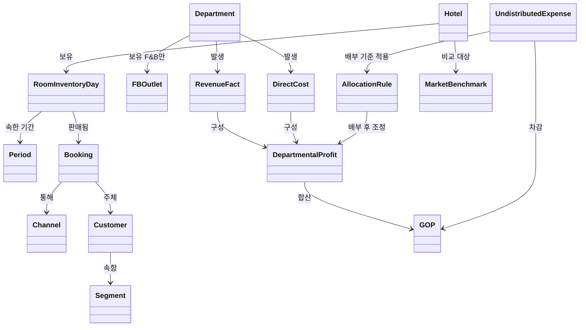

# 워커힐 호텔 성과관리 온톨로지 설계 방안

> [1.1 매출·수익성 지표 흐름](hotel-metrics.md)에서 정리한 지표·용어를 그대로 가져와, 서로 어떻게 참조·파생되는지를 데이터 모델(온톨로지)로 고정합니다.
> 목적은 시스템(데이터 모델링 · BI · 통합)을 만들 때, 같은 용어를 항상 같은 의미·같은 계산식으로 쓰게 하는 것입니다.

---

## 0. 설계 목적과 원칙

**왜 온톨로지가 필요한가** — 1.1에서 본 지표들은 서로를 참조합니다. RevPAR는 OCC×ADR이고, GOPPAR는 부문 이익들의 합에서 공통비를 뺀 값입니다. 이 관계를 문서로만 적어두면 시스템마다 다르게 구현되기 쉽습니다. 온톨로지로 고정하면 "부문 이익"이 배부 전인지 후인지, "원가율"이 표준인지 실제인지가 설계 단계에서부터 명확해집니다.

**설계 원칙**

1. **사실(Fact)과 지표(Metric)를 분리한다** — `RevenueFact`·`DirectCost` 같은 원천 데이터와, 거기서 계산되는 `ADR`·`RevPAR` 같은 파생 지표를 서로 다른 레이어에 둡니다.
2. **배부 전/후는 같은 클래스의 속성값으로 공존시킨다** — 5장의 함정("이익률 30% vs 5%")을 데이터 모델에서부터 봉합합니다.
3. **시간은 1급 개체로 둔다** — Flow-through처럼 전년 대비가 전제인 지표를 표현하려면 기간 비교가 구조적으로 가능해야 합니다.
4. **부문(Department)을 공통 축으로 삼는다** — 매출·직접비·이익·Flow-through가 전부 부문을 거쳐 연결됩니다.
5. **신뢰도 속성을 명시한다** — 고객 통합키 매핑률처럼 지표의 신뢰도를 좌우하는 값은 숫자 자체와 별도로 품질 속성으로 모델링합니다.

---

## 1. 핵심 클래스 개요

| 클래스 | 정의 | 1.1 근거 |
|---|---|---|
| Hotel | 대상 호텔(기준 호텔) | 0장 |
| Period | 집계 기간(일·월·전년 동기) | 7장 |
| RoomInventoryDay | 일자별 객실 재고(가용·판매·OOO) | 1장 |
| Booking | 예약/판매 1건 | 1~2장 |
| Channel | 판매 채널(OTA·직판) | 2장 |
| Customer | 고객 | 9장 |
| Segment | 고객 세그먼트 | 9장 |
| Department | 영업 부문(객실·F&B·연회·기타) | 4장 |
| FBOutlet | F&B 업장(좌석·영업시간) | 3장 |
| RevenueFact | 부문별 매출 사실 | 4장 |
| DirectCost | 부문 직접비 | 4장 |
| DepartmentalProfit | 부문 이익(배부 전/후) | 4~5장 |
| UndistributedExpense | 미배부 공통비 | 5장 |
| AllocationRule | 공통비 배부 기준 | 5장 |
| GOP | 총영업이익 | 6장 |
| MarketBenchmark | 시장 벤치마크 데이터(STR 등) | 8장 |
| Metric | 파생 지표(공식·범위를 가진 메타 클래스) | 전체 |

---

## 2. 클래스 다이어그램

---

## 3. 클래스별 속성 정의

### 3.1 재고·판매 축

| 클래스 | 속성 | 설명 |
|---|---|---|
| Hotel | roomCount | 500실처럼 호텔의 전체 객실 수 |
| Period | startDate, endDate, label | "2026-12", "전년 동월" 등 비교 기준 |
| RoomInventoryDay | availableRooms, soldRooms, oooRooms | OOO는 가용객실에서 제외 (1장) |
| Booking | roomRate, roomNights | 판매 시점의 요금·숙박일수 |
| Channel | channelType(OTA\|Direct), commissionRate | OTA는 통상 15~20% (2장) |
| Customer | customerIntegrationKey, matchConfidence | 객실·F&B 기록을 묶는 키와 그 신뢰도 (9장) |
| Segment | name | 개인레저·개인비즈니스·기업·단체·MICE·컴프 |

### 3.2 부문손익 축

| 클래스 | 속성 | 설명 |
|---|---|---|
| Department | name(Rooms\|FB\|Banquet\|Other) | USALI 부문 구분 |
| FBOutlet | seats, operatingHours | RevPASH 계산에 쓰임 (3장) |
| RevenueFact | amount, period, department | 부문별 매출 |
| DirectCost | amount, period, department, includesChannelCommission | **채널 수수료는 객실 부문 직접비에 포함** (4장 명시) |
| DepartmentalProfit | amount, basis(preAllocation\|postAllocation), isOfficial | 같은 부문·기간에 대해 배부 전/후 두 값을 모두 보존 |

### 3.3 공통비·전사 축

| 클래스 | 속성 | 설명 |
|---|---|---|
| UndistributedExpense | category(관리\|마케팅\|시설\|에너지), amount | 어느 부문에도 안 떨어지는 비용 (5장) |
| AllocationRule | method(revenue\|area\|headcount), ratio | 부문별 배부 비율 |
| GOP | amount, period | 부문 이익 합계 − 미배부 공통비 (6장) |

### 3.4 벤치마크 축

| 클래스 | 속성 | 설명 |
|---|---|---|
| MarketBenchmark | source(STR 등), marketOCC, marketADR, marketRevPAR | 시장 평균값, MPI·ARI·RGI 계산의 분모 (8장) |

---

## 4. 지표(Metric) 레이어 설계

지표는 별도 테이블이 아니라 **공식(formula) · 범위(scope) · 입력(inputs)을 가진 메타 클래스**로 다룹니다. 이렇게 하면 "이 지표는 호텔 전체 범위인가, 부문 범위인가"를 코드가 아니라 데이터로 검증할 수 있습니다 (6장에서 다루는 GOPPAR 오용 방지와 직결).

| 지표 | 공식 | 범위(scope) | 근거 |
|---|---|---|---|
| OCC | 판매객실 ÷ 가용객실 | Hotel | 1장 |
| ADR | 객실매출 ÷ 판매객실 | Hotel | 1장 |
| RevPAR | 객실매출 ÷ 가용객실 (= OCC×ADR) | Hotel | 1장 |
| Net ADR | ADR × (1 − 수수료율) | Channel | 2장 |
| NRevPAR | (객실매출 − 채널수수료) ÷ 가용객실 | Hotel | 2장 |
| 객단가 | F&B매출 ÷ 커버수 | FBOutlet | 3장 |
| RevPASH | F&B매출 ÷ (좌석수×영업시간) | FBOutlet | 3장 |
| 식자재원가율 | 식자재원가 ÷ F&B매출 | FBOutlet | 3장 |
| 표준원가율 | 레시피 기준 이론원가 ÷ F&B매출 | FBOutlet | 3장 |
| GOPPAR | GOP ÷ 가용객실 | **Hotel 전용** | 6장 |
| Flow-through | ΔDepartmentalProfit ÷ ΔRevenueFact | Hotel 또는 Department | 7장 |
| MPI | 자사OCC ÷ 시장OCC × 100 | Hotel vs Market | 8장 |
| ARI | 자사ADR ÷ 시장ADR × 100 | Hotel vs Market | 8장 |
| RGI | 자사RevPAR ÷ 시장RevPAR × 100 (= MPI×ARI÷100) | Hotel vs Market | 8장 |
| Attach Rate | F&B 이용 투숙객 ÷ 전체 투숙객 | Hotel | 9장 |
| CLV | Σ(객실+F&B+연회+레저 매출) per Customer | Customer | 9장 |

---

## 5. 핵심 관계 정의

| 관계 | 도메인 | 레인지 | 설명 |
|---|---|---|---|
| 보유 | Hotel (1) | RoomInventoryDay (N) | 일자별 재고 |
| 판매됨 | RoomInventoryDay (1) | Booking (N) | 판매 객실의 근거 |
| 통해 | Booking (N) | Channel (1) | 수수료율 결정 |
| 발생 | Department (1) | RevenueFact, DirectCost (N) | 부문별 손익 구성요소 |
| 구성 | RevenueFact, DirectCost (N) | DepartmentalProfit (1) | 매출−직접비 |
| 배부 후 조정 | AllocationRule (1) | DepartmentalProfit (N) | 같은 부문에 basis=postAllocation 레코드 생성 |
| 합산/차감 | DepartmentalProfit, UndistributedExpense (N) | GOP (1) | 전사 이익 산출 |
| 비교 대상 | Hotel (1) | MarketBenchmark (N) | MPI·ARI·RGI 계산 |

---

## 6. 1.1의 함정을 온톨로지 제약으로 반영

| 1.1의 함정 (부록 C) | 온톨로지 상의 대응 |
|---|---|
| ① 매출만 보면 수수료 유출이 안 보임 | `DirectCost.includesChannelCommission`을 필수 속성으로 두어, NRevPAR 계산 시 반드시 조인하도록 강제 |
| ② 부문 이익은 배부 여부를 확인해야 함 | `DepartmentalProfit.basis`를 enum(필수값)으로, `isOfficial` 플래그로 "판정 기준"을 하나로 고정 |
| ③ GOPPAR로 F&B를 평가하면 안 됨 | `Metric(GOPPAR).scope = Hotel`로 고정해, Department 범위 질의에는 노출되지 않도록 검증 규칙 적용 |
| ④ Flow-through는 전년 대비가 전제 | `Metric(FlowThrough).requires = PeriodComparison(≥2)` — Period가 1개뿐이면 계산 자체를 막음 |
| ⑤ 원가율은 표준 대비로 봐야 함 | `식자재원가율` 옆에 `표준원가율`을 항상 병행 속성으로 묶어, 단독 조회를 지양 |
| ⑥ CLV는 매핑률이 생명 | `Customer.matchConfidence`를 CLV·Attach Rate의 신뢰도 가중치로 함께 노출 |

---

## 7. 다음 단계

1. 위 클래스를 실제 DB 스키마(또는 시맨틱 모델)로 옮길 때, `DepartmentalProfit`처럼 **배부 전/후가 공존하는 테이블**은 반드시 basis 컬럼으로 구분해 적재합니다.
2. BI 툴에서 GOPPAR를 부문별로 쪼개서 보여주는 대시보드가 있다면, 이 온톨로지 기준으로는 **설계 오류**이므로 우선 점검 대상입니다.
3. 고객 통합키 매핑률이 낮은 세그먼트(워크인·현금결제)는 CLV를 별도로 "신뢰도 낮음" 표시하는 것을 권장합니다.
