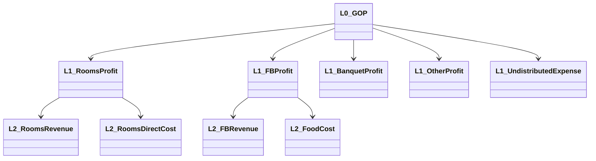

# 워커힐 성과관리 온톨로지 설계 방안

> 이 문서는 `전개표.xlsx`(HQ Summary + HQ-1~7_전개표 + 보유/미보유/필요데이터/KPI 목록, 총 11개 시트)를 기준으로 설계했습니다.
> 이전 버전은 [1.1 매출·수익성 지표 흐름](hotel-metrics.md)의 서술형 예시만으로 만들었지만, 실제로는 지주사 차원의 **7대 전략 질문**을 KPI·데이터·원천까지 끝까지 추적하는 체계가 이미 존재했습니다. 그 체계의 **스키마(클래스·관계)를 정의**하는 것이 이 문서의 역할이고, 실제 인스턴스(수백 건의 질문·지표·데이터·갭)는 원본 엑셀이 1차 소스입니다.

---

## 0. 설계 목적과 원칙

**왜 다시 설계했는가** — 1.1만으로 만든 이전 온톨로지는 "호텔 P&L 지표가 서로 어떻게 계산되는가"만 다뤘습니다. 실제 전개표는 그보다 훨씬 넓습니다: **자본배분·포트폴리오·공유자산·리스크**까지 포함한 7개 전략 질문 각각을, 질문→지표→데이터→원천 DB 컬럼까지 한 줄로 추적하고, 각 단계마다 "지금 답할 수 있는가(판정)"와 "못 하면 무엇부터 해결해야 하는가(우선순위)"를 명시적으로 달아둔 **데이터 거버넌스 온톨로지**였습니다.

**설계 원칙**

1. **질문이 1급 개체다** — KPI가 먼저 있고 질문이 따라오는 게 아니라, 지주사의 의사결정 질문(HQ)이 먼저 있고 그걸 풀기 위해 필요한 지표·데이터가 역산됩니다.
2. **"계산 가능"과 "데이터 보유"를 분리한다** — 공식은 알아도 원천이 없으면 미보유입니다. 모든 노드(질문·지표·데이터·갭)에 **판정 상태**를 독립적으로 붙입니다.
3. **재사용되는 분해 축은 별도 차원으로 뗀다** — "층2 USALI", "층3 여정", "부속축 자본" 같은 분해 구조는 여러 질문·KPI에서 공유되므로, 질문 트리와는 별개의 차원(axis)으로 모델링합니다.
4. **원천까지 추적 가능해야 갭이 실재한다** — 모든 갭(Gap)은 가능하면 실제 스키마.테이블.컬럼까지 연결합니다. "데이터가 없다"가 아니라 "`wh_sknst_ods.opera_transaction`에 없다"까지 말할 수 있어야 합니다.
5. **우선순위 없는 갭 목록은 로드맵이 아니다** — 모든 갭에 P0/P1/P2를 매겨, "무엇부터 막힌 걸 뚫어야 하는가"가 데이터에서 바로 나오게 합니다.

---

## 1. 7대 전략 질문 한눈에

| HQ | 질문 | Lever | BQ 판정가능 | 지표 산출가능 | 데이터 보유 | GAP 해소 |
|---|---|---|---|---|---|---|
| HQ-1 | 워커힐은 그룹 내에서 계속 보유·투자할 최적 자산인가 | L1 자본배분 | 0/5 (0%) | 0/3 (0%) | 1/7 (14%) | 6/15 (40%) |
| HQ-2 | 어느 자산·시설에 추가 자본을 배분할 것인가 | (HQ-1과 동일 축) | 0/5 (0%) | 0/3 (0%) | 1/7 (14%) | 6/15 (40%) |
| HQ-3 | 시장 성장과 내부 성장의 격차는 어디서 발생하는가 | L2 포트폴리오 | 13/32 (41%) | 6/24 (25%) | 6/16 (38%) | 25/37 (68%) |
| HQ-4 | 카지노·임대·대외사업은 자본 효율을 높이는가 | L2 포트폴리오 | 1/11 (9%) | 0/6 (0%) | 5/14 (36%) | 21/34 (62%) |
| HQ-5 | 본사의 AI·데이터·공유역량은 워커힐 가치를 높이는가 | L4 공유자산 투입 | 6/10 (60%) | 2/5 (40%) | 3/7 (43%) | 16/17 (94%) |
| HQ-6 | 워커힐은 지속가능한 경영을 수행하고 있는가 | L5 리스크 게이트 | 0/6 (0%) | 0/4 (0%) | 2/9 (22%) | 12/19 (63%) |
| HQ-7 | SK네트웍스는 워커힐의 가치창출에 어떻게 기여하고 있는가 | L4 공유자산 투입 | 1/3 (33%) | 0/2 (0%) | 2/2 (100%) | 6/6 (100%) |

**읽는 법** — HQ-3(시장·내부 성장 격차)이 가장 준비도가 높습니다(BQ 41%). 1.1 문서가 다룬 OCC·ADR·RevPAR·채널·세그먼트가 바로 이 질문의 데이터 기반입니다. 반대로 HQ-1·HQ-2(자본배분)는 **0%** — 투하자본·CapEx·자산 장부가가 ERP·DAP 어디에도 없어, 질문 자체가 아직 "분석 과제로 성립하지 않는" 단계입니다.

---

## 2. 질문 계보(Question Lineage) 클래스

전략 질문은 4단계로 분해되는 **자기참조 트리**입니다: `HQ → SQ → DQ → BQ`. BQ(판정 가능한 비즈니스 질문)에 도달하면 그 아래로 KPI가 달립니다.

| 클래스 | 속성 | 설명 |
|---|---|---|
| HQ | id, 질문문, Lever, 결정권자 | 지주사 CEO가 던지는 최상위 전략 질문 (7개) |
| SQ | id, 질문문 | HQ를 쪼갠 하위 질문 (예: "자본배분", "고객 전체가치") |
| DQ | id, 질문문 | SQ를 더 쪼갠 분해 질문 — 보통 지표 하나로 답이 나오는 수준 |
| BQ | id, 질문문, 판정조건 | 실제 임계값으로 "예/아니오"가 갈리는 질문. **판정조건**이 핵심 속성 |

**실제 경로 예시 (HQ-3)**

> HQ-3. 시장 성장과 내부 성장의 격차는 어디서 발생하는가
> › SQ-1. 이익 희석 — 성장액 중 얼마가 이익으로 전환되는가
> › DQ-1.1. 부문별(객실·F&B·BQT·대외·임대) Flow-through는 얼마인가
> › BQ-1.1-1. 매출은 늘었는데 부문 이익이 따라 오르지 않은 부문은 어디인가
> › **판정조건**: 부문 Flow-through가 산업표준 밴드 하한 미만(객실 60%·F&B 35%·전체 35%) 또는 음수
> › KPI-FT-01~05 (부문별 Flow-through)

이 판정조건이 바로 1.1 7장의 "산업 표준 밴드"와 동일합니다 — 1.1의 서술이 실제로는 BQ-1.1-1의 판정 기준이었던 것입니다.

---

## 3. KPI(지표) 클래스

이전 버전의 Metric보다 속성이 확장됩니다. 특히 **같은 지표라도 산출 기준(ERP vs USALI)에 따라 상태가 갈리는 경우**가 실제로 존재합니다.

| 속성 | 설명 |
|---|---|
| KPI ID | 예: `KPI-FT-01`, `KPI-GOP-03` |
| 지표군 | 같은 계열 지표 묶음 (예: "Flow-through(%)") |
| 소속 축 | 아래 6개 범주 중 하나 |
| 값 상태 | `actual`(실제 집계 가능) / `pending-actual`(산식은 있으나 입력 대기) |
| 보유 판정 | 보유 · 부분보유 · 미보유 · 외부조달 · 미기재 |
| 판정 근거 | 보유 판정을 내린 이유 (자유 텍스트) |

**소속 축 6개 범주**

| 축 | 의미 | 예 |
|---|---|---|
| A. 자본 | 자본배분·투하자본 | ROIC, CapEx 회수기간 |
| B. 손익 | 전사/ERP 기준 손익 | 인건비율, Flow-through(전사, ERP 기준) |
| C. USALI | 호텔업 표준 부문 손익 | GOPPAR, Flow-through(부문별, USALI 기준) |
| D. 여정 | 고객 여정·판매 지표 | OCC, ADR, RevPAR, CLV, attach rate |
| E. 시장 | 외부 벤치마크 | MPI, ARI, RGI |
| F. 비재무 | ESG·안전·AI 전환 | 에너지 원단위, 안전사고, AI 전환이익 |

**핵심 발견 — 같은 KPI가 기준에 따라 이중 상태를 가진다**

Flow-through(KPI-FT-00~05)는 "부분보유"인데, 그 이유가 특이합니다:

> **ERP 영업이익 기준으로는 `actual`(지금 산출 가능)** — 하지만 **USALI 부문 GOP 기준으로는 `pending-actual`**(부문 원가 배부 규칙이 없어서 불가).

즉 1.1 문서가 보여준 "GOP 22억, Flow-through 25%"라는 숫자는 **USALI 기준이 아니라 ERP 영업이익 기준**으로 계산 가능한 버전이었다는 뜻입니다. 1.1은 이 구분을 명시하지 않았으므로, 8절에서 다시 짚습니다.

---

## 4. 분해 축(재사용 차원) 클래스

여러 질문·KPI가 공통으로 참조하는 **재사용 가능한 분해 구조**가 3종 있습니다. 질문 트리와 독립적인 별도 차원으로 모델링합니다.

| 축 | 노드 수 | 보유 | 용도 |
|---|---|---|---|
| 층2 USALI | 24 | 5 | GOP → 부문이익 → 부문 매출/원가로 내려가는 손익 분해 |
| 층3 여정 | 37 | 19 | 고객 → 채널 → 세그먼트 → 업장 → 예약(선행) → 공간·시간 → 인력으로 내려가는 고객 여정 분해 |
| 부속축 자본 | 9 | 2 | ROIC → 투하자본 → 자산군별 분해 |

**층2 USALI 축의 레이어 구조** (이전 버전 1.3의 클래스 다이어그램이 바로 이 축이었습니다)

**층3 여정 축**은 고객/채널/세그먼트/업장/예약(선행)/공간·시간/인력 7개 하위 축으로 구성되며, 그중 **인력 축은 FTE·근무시간·외주 데이터가 0건**이라 CPOR·HPOR 계열 지표가 전부 막혀 있습니다 — HQ-6(지속가능경영)과 HQ-5(공유역량)가 낮은 이유의 공통 원인입니다.

---

## 5. 데이터셋(Dataset)·갭(Gap) 클래스

| 클래스 | 속성 |
|---|---|
| Dataset (D-01~D-27) | id, 데이터 항목, 데이터 구조(grain), 필요 주기, 보유 판정, 연결 GAP, **없으면 무엇이 막히나** |
| Gap (G-xx, 65건) | id, 우선순위(P0/P1/P2), 갭 항목, 판정, 보유 현황·원천, 영향 질문, 조치(미보유 항목만) |

**"없으면 무엇이 막히나"가 핵심 필드인 이유** — 이 필드 덕분에 갭 하나가 어떤 KPI·질문을 막는지 역추적할 수 있습니다. 예:

| Dataset | 보유 판정 | 없으면 무엇이 막히나 |
|---|---|---|
| D-01 부문별 매출 | 보유 | — |
| D-02 부문별 직접원가 | **미보유** | 부문 이익을 만들 수 없음. USALI 층2 트리 전체가 미확정 |
| D-03 공통비 배부 규칙 | **미보유** | 부문 손익이 배부 전/후로 갈려 어느 숫자로 판단할지 정해지지 않음 (1.3 이전 버전의 함정②와 동일) |
| D-09 채널별 수수료율 | **미보유** | NRevPAR를 만들 수 없어 직판 전환 효과가 드러나지 않음 |
| D-14 투하자본·자산 장부가 | **미보유** | ROIC의 분모가 없어 HQ-1에 답할 수 없음 |

---

## 6. 원천 계보(Source Lineage)

갭(Gap)은 가능한 한 실제 DB 스키마·테이블·컬럼까지 연결됩니다. 보유 판정이 "보유"인 항목의 예:

| Gap | 원천 스키마 | 원천 테이블 | 비고 |
|---|---|---|---|
| G-D03 객실 매출·요금 | `wh_sknst_ods`, `wh_skndw` | `opera_transaction`, `opera_rate`, `ro_room_acmp_info` | KPI-RM-02 ADR · KPI-RM-03 RevPAR의 근거 |
| G-D11 고객 통합 ID | — | `cu_intg_cstm_mpng_info` | 워커힐통합고객번호 ↔ UCRS 멤버십 연결, 매핑율은 미측정 |
| G-D09 표준원가(양목표) | — | `wingspos_tb_st_recipe_mst` | 1.1 3장의 "표준원가율 32%"가 바로 이 테이블 |

반대로 **미보유** 항목은 원천 칸이 비어 있거나 "없음"으로 명시됩니다 (예: G-F11 OTA 채널수수료 — "726501 신용카드수수료는 있으나 OTA 커미션 계정 불명").

---

## 7. 통제 어휘 (Controlled Vocabulary)

| 구분 | 값 | 의미 |
|---|---|---|
| 판정 | 보유 | 원천이 있고 바로 쓸 수 있음 |
| | 부분보유 | 일부만 있거나 연결 작업이 더 필요함 |
| | 미보유 | 원천 자체가 없음 |
| | 외부조달 | 내부에 존재할 수 없는 데이터 (시장 벤치마크 등) — 구매·계약 필요 |
| | 미기재 / 판정 없음 | 아직 판정을 안 했거나, 순수 계보 노드라 판정 대상이 아님 |
| 값 상태 | actual | 지금 기준으로 실제 집계 가능 |
| | pending-actual | 산식은 정의됐지만 입력 데이터가 모자람 |
| 우선순위 | P0 | 여러 질문을 동시에 막는 핵심 갭 — 최우선 해소 |
| | P1 | 특정 질문·부문을 막는 갭 |
| | P2 | 영향 범위가 좁거나 장기 과제 |

---

## 8. 1.1 문서와의 정합성 재검토

1.1(hotel-metrics.md)은 이 전체 체계 중 **HQ-3의 D.여정 / C.USALI 축에서, 이미 "보유" 판정인 KPI만** 골라 서술한 것이었습니다. 이번 전개표로 다시 보니 짚어야 할 차이가 있습니다.

| 1.1의 서술 | 전개표 상 실제 판정 | 의미 |
|---|---|---|
| OCC·ADR·RevPAR | 보유 (actual) | 그대로 유효 |
| NRevPAR | **부분보유** — 채널은 있으나 수수료율(D-09, G-F11) 미보유 | 1.1의 "수수료 18%"는 **가정값**이지 원천에서 나온 실수가 아님 |
| GOP·GOPPAR | **미보유** — USALI 부문 손익이 서지 않음(D-02·D-03 미보유) | 1.1의 GOP 22억은 **ERP 영업이익 기준의 유사치**였지, USALI GOP가 아직 없음 |
| Flow-through | **부분보유**, ERP 기준만 actual | 1.1의 25%/15%는 ERP 기준. USALI 기준 Flow-through는 아직 산출 불가 |
| 식자재 원가율 | 표준원가(G-D09)는 보유, 실원가 대사 규칙은 미확정 | 1.1의 "실제 35%"는 **대사 규칙이 확정되면 바뀔 수 있는 잠정치** |
| Attach Rate | **보유** (즉시 산출 가능) | 1.1에서는 개념만 소개했지만, 실제로는 이미 계산 가능한 지표 |
| MPI·ARI·RGI | **외부조달** | STR 등 상업 데이터 구독 전까지는 원천 자체가 없음 |

**결론** — 1.1은 "값이 어떻게 계산되는가"를 가르치는 문서로는 여전히 유효하지만, "그 값이 지금 신뢰할 수 있는 실측치인가"는 전개표의 판정 상태를 따로 확인해야 합니다.

---

## 9. 에이전트(agent/) 설계에 대한 함의

지금 `agent/` 폴더의 추정/추론 에이전트는 **전부 "actual·보유"라고 가정한 샘플 데이터**로 만들어졌습니다. 전개표 기준으로 보면 시스템 프롬프트에 다음을 추가해야 더 정직한 에이전트가 됩니다.

1. KPI를 계산할 때는 그 값이 **actual인지 pending-actual인지** 먼저 밝힙니다 (예: "이 GOP는 ERP 영업이익 기준이며, USALI 부문 배부 규칙이 아직 없어 공식 GOP와 다를 수 있습니다").
2. NRevPAR·GOPPAR처럼 **부분보유/미보유 갭 위에 서 있는 지표**는 "원천 미확정" 경고를 답변에 포함합니다.
3. P0 갭(아래 10절)과 관련된 질문이 들어오면, 계산 대신 "이 갭이 먼저 해소돼야 한다"고 답하도록 가드레일을 추가할 수 있습니다.

---

## 10. 우선 해결 과제 (P0 갭)

여러 질문을 동시에 막고 있는 P0 갭 중 핵심만 추립니다 (전체 목록은 `전개표.xlsx`의 "미보유데이터 목록" 시트).

| Gap | 막고 있는 것 |
|---|---|
| G-01 부문 원가 배부 규칙 | USALI 부문 손익 전체(D-02, D-03) — HQ-3의 핵심 병목 |
| G-02 고객 통합 ID 매핑율 | CLV·attach rate의 신뢰도 (키는 있으나 매핑율 미측정) |
| G-F01 부문별 매출 매핑 확정 | 부문 Flow-through(KPI-FT-01~05) |
| G-F02 부문별 직접원가 | 부문 이익 자체를 만들 수 없음 |
| G-F04 인건비 업장·직군 배부 | CPOR — 인건비율의 "매출 늘면 착시로 좋아지는" 문제의 근본 원인 |
| G-F11 OTA 채널수수료 | NRevPAR — 1.1이 가정값으로 대체했던 바로 그 숫자 |
| G-C02 표준원가·배부 룰 버전관리 | 식자재 원가율의 실원가 대사 |
| G-04 / G-C05 KPI 임계 확정 | Flow-through를 제외한 전 지표가 아직 "기본값 ±5%"로만 판정 중 |
| G-06 투하자본·CapEx·자산가치 | HQ-1·HQ-2 전체 (0% 커버리지의 직접 원인) |
| G-X01 Comp Set 벤치마크 (STR) | MPI·ARI·RGI — 외부조달 필요 |
